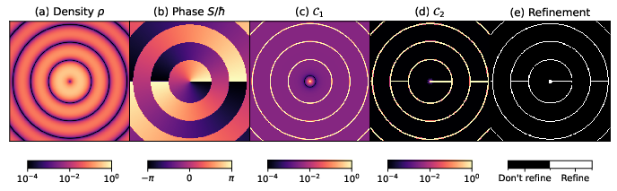

# Usage

Run `python3 generate_figure_{i}.py` or `sh generate_figures.sh` for figures 1-18, excluding figures 2 and 5. Figure 5 needs to be compiled using LaTeX. You can view Figure 5 on Overleaf [here](https://www.overleaf.com/read/qgkdndnqrgjm#9e5243).

## Figures

Here are the figures generated by the scripts:


[Download Figure 1 (PDF)](figures/figure_1.pdf)


[Download Figure 2 (PDF)](figures/figure_2.pdf)


[Download Figure 3 (PDF)](figures/figure_3.pdf)


[Download Figure 4 (PDF)](figures/figure_4.pdf)


[Download Figure 5 (PDF)](figures/figure_5.pdf)

  **Note**: Figure 5 was generated using LaTeX. You can also view the LaTeX source on Overleaf [here](https://www.overleaf.com/read/qgkdndnqrgjm#9e5243).
- 
  [Download Figure 6 (PDF)](figures/figure_6.pdf)
- 
  [Download Figure 7 (PDF)](figures/figure_7.pdf)
- 
  [Download Figure 8 (PDF)](figures/figure_8.pdf)
- 
  [Download Figure 9 (PDF)](figures/figure_9.pdf)
- 
  [Download Figure 10 (PDF)](figures/figure_10.pdf)
- 
  [Download Figure 11 (PDF)](figures/figure_11.pdf)
- 
  [Download Figure 12 (PDF)](figures/figure_12.pdf)
- 
  [Download Figure 13 (PDF)](figures/figure_13.pdf)
- 
  [Download Figure 14 (PDF)](figures/figure_14.pdf)
- 
  [Download Figure 15 (PDF)](figures/figure_15.pdf)
- 
  [Download Figure 16 (PDF)](figures/figure_16.pdf)
- 
  [Download Figure 17 (PDF)](figures/figure_17.pdf)
- 
  [Download Figure 18 (PDF)](figures/figure_18.pdf)

## Notes
- **Figures 2 and 5**: These figures need special handling. Figure 5 is generated using LaTeX, and you can find the source and view the output on Overleaf [here](https://www.overleaf.com/read/qgkdndnqrgjm#9e5243).
- You can download each figure in PDF format by clicking on the respective **Download** link.

## Installation

To generate these figures on your local machine, ensure that you have the required dependencies installed, such as Python 3 and LaTeX (for Figure 5).

### Python Dependencies
If you haven't already, install the required Python libraries by running:

```bash
pip install -r requirements.txt
```
